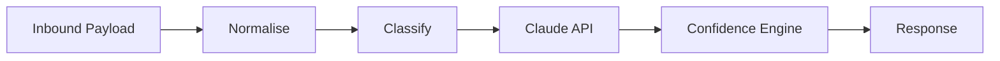

# Nistula Technical Assessment

A backend service that handles inbound guest messages for Nistula's villa rental platform. It receives messages from multiple channels (WhatsApp, Booking.com, Airbnb, Instagram, direct), normalises them into a unified schema, classifies the query type, drafts a reply using Claude, and returns a confidence-scored response.

## Assignment Parts

| Part | Description | File(s) |
|------|-------------|----------|
| 1 | Guest Message Handler — webhook + AI pipeline | `app/` |
| 2 | PostgreSQL Database Schema | `schema.sql` |
| 3 | Thinking Question — 3am complaint scenario | `thinking.md` |

## Quick Start

```bash
# 1. Clone the repo
git clone https://github.com/artorias-66/nistula-technical-assessment.git
cd nistula-technical-assessment

# 2. Install dependencies
npm install

# 3. Create your .env file
cp .env.example .env
# Open .env and paste your Anthropic API key

# 4. Start the server
npm run dev

# 5. Run the test suite (in a separate terminal)
npm test
```

The server starts at `http://localhost:3000`. Hit `GET /health` to confirm it's running.

## API Reference

### `POST /webhook/message`

Accepts an inbound guest message and returns a drafted AI reply.

**Request body:**

```json
{
  "source": "whatsapp",
  "guest_name": "Rahul Sharma",
  "message": "Is the villa available from April 20 to 24?",
  "timestamp": "2026-05-05T10:30:00Z",
  "booking_ref": "NIS-2024-0891",
  "property_id": "villa-b1"
}
```

| Field         | Type   | Required | Notes                                                      |
|---------------|--------|----------|------------------------------------------------------------|
| `source`      | string | yes      | One of: `whatsapp`, `booking_com`, `airbnb`, `instagram`, `direct` |
| `guest_name`  | string | no       | Defaults to "Guest" if missing                             |
| `message`     | string | yes      | The guest's message text                                   |
| `timestamp`   | string | no       | ISO 8601, defaults to current time                         |
| `booking_ref` | string | no       | Existing booking reference, if any                         |
| `property_id` | string | no       | Maps to property context for grounding the AI reply        |

**Response:**

```json
{
  "message_id": "a4f2c8e1-...",
  "query_type": "pre_sales_availability",
  "drafted_reply": "Hi Rahul! Great news — Villa B1 is available...",
  "confidence_score": 0.91,
  "action": "auto_send"
}
```

### `GET /health`

Returns `{ "status": "ok", "timestamp": "..." }`. Useful for uptime monitoring.

## Project Structure

```
app/
├── index.js                # Express server entry point
├── routes/
│   └── webhook.js          # POST /webhook/message handler
├── services/
│   ├── normalizer.js       # Payload → unified schema
│   ├── classifier.js       # Query type classification
│   ├── aiHandler.js        # Claude API integration
│   └── confidence.js       # Confidence scoring + action logic
└── data/
    └── propertyContext.js   # Mock property details for Villa B1
tests/
├── testWebhook.js          # 5 integration test payloads
└── testClassifier.js       # 17 classifier unit tests
schema.sql                   # Part 2 — PostgreSQL database schema
thinking.md                  # Part 3 — Thinking question answers
```

## Architecture

The webhook processes every message through a four-stage pipeline:



| Stage | Module | What it does |
|-------|--------|--------------|
| Normalise | `normalizer.js` | Validates and reshapes the raw payload into a unified schema with a generated UUID |
| Classify | `classifier.js` | Assigns a query type using keyword matching before the AI call |
| AI Draft | `aiHandler.js` | Sends the message + property context to Claude and gets a drafted reply |
| Score | `confidence.js` | Computes a confidence score and decides the action (auto_send / agent_review / escalate) |

Each stage is a separate module so they can be tested, swapped, or extended independently.

## How Confidence Scoring Works

The confidence score (0 to 1) reflects how much we trust the AI-drafted reply to be sent without human review. It's a weighted combination of three signals:

### 1. Classification Clarity — 40% weight

How cleanly did the message match a query type? The classifier counts keyword hits against each category. More hits means stronger signal, so the prompt we sent to Claude was more targeted.

| Keyword hits | Score |
|-------------|-------|
| 0           | 0.30  |
| 1           | 0.60  |
| 2           | 0.80  |
| 3+          | 1.00  |

### 2. Property Context Available — 30% weight

Did we have property details to ground the response? Without factual context, the AI might generate a plausible-sounding but incorrect reply — dangerous for a hospitality brand.

| Context      | Score |
|-------------|-------|
| Known property | 1.00 |
| Unknown     | 0.30  |

### 3. Query Complexity — 30% weight

Some query types are inherently safer to auto-reply than others. Availability and check-in info are factual lookups; complaints and special requests need human judgement.

| Query type               | Score |
|--------------------------|-------|
| `pre_sales_availability` | 1.00  |
| `post_sales_checkin`     | 1.00  |
| `pre_sales_pricing`      | 0.80  |
| `general_enquiry`        | 0.80  |
| `special_request`        | 0.50  |
| `complaint`              | 0.20  |

### Action Thresholds

| Score range  | Action         | Meaning                                    |
|-------------|----------------|--------------------------------------------|
| ≥ 0.85      | `auto_send`    | High confidence — send without review      |
| 0.60 – 0.84 | `agent_review` | Decent draft but a human should check it   |
| < 0.60      | `escalate`     | Low confidence — route to a team member    |
| Any (complaint) | `escalate` | Complaints always escalate, regardless of score |

### Why this design?

I wanted the scoring to be **explainable**. A black-box number doesn't help an ops team decide whether to trust the system. With three named dimensions, you can look at a low score and immediately say *"ah, we didn't have property context"* or *"the classifier wasn't sure what they were asking."* This also makes it easy to tune — if you find pricing replies are consistently good, bump the complexity score for that type without touching anything else.

## Design Decisions

**Why keyword classification instead of using Claude for it?**
Classification needs to be fast and deterministic. A keyword approach runs in microseconds, costs nothing, and gives us a query type *before* calling Claude — so we can tailor the system prompt per category. It's also easy to debug: you can see exactly which keywords matched and why.

**Why CommonJS instead of ES modules?**
I chose CommonJS to keep the setup frictionless and aligned with the default Express ecosystem tooling. Either convention would work here — this avoided the `.mjs` / `"type": "module"` configuration overhead for a project of this size.

**Idempotency:**
In production, I would add idempotency handling (e.g. deduplication on a hash of `source + guest_name + message + timestamp`) to prevent duplicate message processing if a channel provider retries the webhook delivery.

**Why a separate confidence module instead of asking Claude to self-rate?**
LLMs are not reliable self-assessors. They tend to be confidently wrong. The confidence score here measures *how well-positioned the system was to generate a good answer* (clear intent + good context + safe query type), not how good the model thinks its own output is.

## Error Handling

- **Missing required fields** (`message`, `source`): returns `400` with a descriptive error.
- **Unknown source channel**: returns `400` listing valid options.
- **Claude API failure** (rate limit, timeout, invalid key): returns `500` with a generic message. In development mode (`NODE_ENV=development`), the actual error is included for debugging.
- **Unknown routes**: returns `404`.

## Testing

**Integration tests** (`npm test`) — sends 5 payloads covering all major query types:

1. Availability check via WhatsApp
2. Check-in info request via Airbnb
3. Complaint via Booking.com
4. Special request via Instagram
5. General enquiry via direct channel

Start the server (`npm run dev`) in one terminal, then run `npm test` in another.

**Classifier unit tests** (`npm run test:unit`) — 17 cases covering keyword matching, tiebreak logic, multi-category messages, and edge cases like zero-keyword fallback. These run offline with no server or API calls needed.

## Future Improvements

Given more time, I would improve the system in these areas:

- **Smarter classification** — replace keyword matching with a lightweight embedding classifier (e.g. sentence-transformers + cosine similarity) for better handling of ambiguous or multilingual messages.
- **Conversation memory** — maintain thread context so follow-up messages ("Actually, make that 3 nights") don't get classified in isolation.
- **Reservation lookup** — query the database by `booking_ref` to inject real booking details (dates, guest count, payment status) into the Claude prompt.
- **Webhook reliability** — queue inbound messages using BullMQ or SQS so a Claude API timeout doesn't lose the guest's message.
- **Retry + circuit breaker** — add exponential backoff for Claude API calls and a circuit breaker to fail fast during sustained outages.
- **Persistence** — store all inbound/outbound messages in PostgreSQL (the schema in `schema.sql` is designed for this).
- **Observability** — add structured logging with correlation IDs and track classification accuracy over time to tune confidence thresholds.
